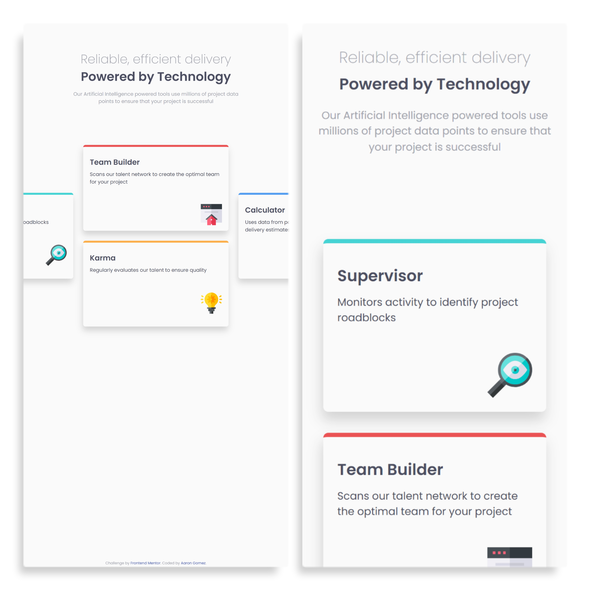

# Frontend Mentor - Four card feature section solution

This is a solution to the [Four card feature section challenge on Frontend Mentor](https://www.frontendmentor.io/challenges/four-card-feature-section-weK1eFYK). Frontend Mentor challenges help you improve your coding skills by building realistic projects. 

## Table of contents

- [Frontend Mentor - Four card feature section solution](#frontend-mentor---four-card-feature-section-solution)
  - [Table of contents](#table-of-contents)
  - [Overview](#overview)
    - [The challenge](#the-challenge)
    - [Screenshots](#screenshots)
  - [My process](#my-process)
    - [Built with](#built-with)
    - [What I learned](#what-i-learned)
    - [Continued development](#continued-development)
    - [Useful resources](#useful-resources)

## Overview

### The challenge

Users should be able to:

- View the optimal layout for the site depending on their device's screen size

### Screenshots

Desktop | Mobile


## My process

### Built with

- Semantic HTML5 markup
- CSS custom properties
- Flexbox
- CSS Grid
- Mobile-first workflow

### What I learned

I learned a lot about Grid and about using different layout techniques together.
For example, I was trying to figure out how to get the offsetting card look, 
then realized I could simply divide the height of the card by 2, then use that
as the height of the grid rows. Then it was just a matter of laying the card
out in those rows and columns.

```css
  main {
      display: grid;
      padding: 2rem;
      grid-template-columns: repeat(6, 1fr);
      grid-template-rows: repeat(4, 115px);
      gap: 2rem;
  }
```

I also learned a bit more about using the `:root` selector to initialize CSS
variables. I really like that approach because I could simply define all of the
color pallete before hand and reuse as necessary. It also added more semantics
to the stylesheet. 

```css
  :root {
      --primary-red: hsl(0, 78%, 62%);
      --primary-cyan: hsl(180, 62%, 55%);
      --primary-orange: hsl(34, 97%, 64%);
      --primary-blue: hsl(212, 86%, 64%);
      --neutral-dark-blue: hsl(234, 12%, 34%);
      --neutral-gray-blue: hsl(229, 6%, 66%);
      --neutral-light-gray: hsl(0, 0%, 98%);
      font-size: 15px;
      font-family: 'Poppins', sans-serif;
      color: var(--neutral-gray-blue);
  }
```
Some other stuff I learned was how to upload a local repo using the CLI using
`git push` but having to do it with GitHub's tokens. I was able to perform
that simple operation in the past before they switched off username/pwd for
push operations. But I figured out how to do it by altering the remote URL.

### Continued development

I would like to see if I could build this sort of layout using only CSS Grid. I've
seen some examples using `repeat(auto-fit, minmax(<some values>))` where you can
dynamically create columns as the viewport expands and contracts. It required some
clumsy uses of selectors and calculations, but it would be nice to limit the 
number of media queries.

### Useful resources

- [Fix password authentication for Git/GitHub](https://levelup.gitconnected.com/fix-password-authentication-github-3395e579ce74) - This helped me with my Git/GH
authentication problems.
- [Responsive grid (no media queries)](https://css-tricks.com/responsive-grid-magazine-layout-in-just-20-lines-of-css/) - This is something I'd
like to explore more.